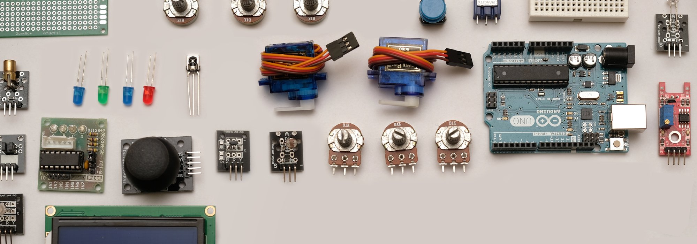
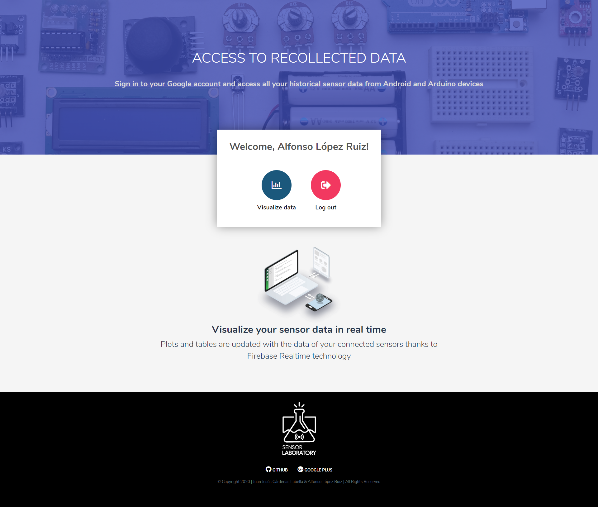
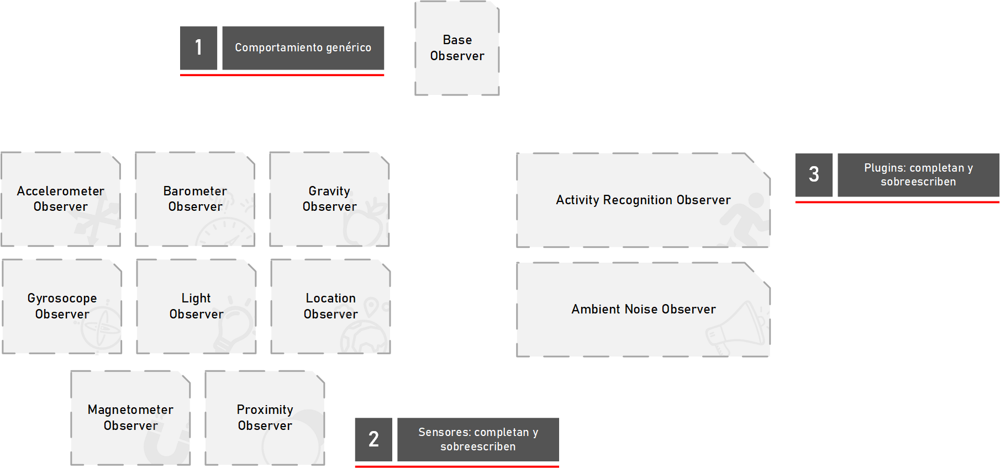
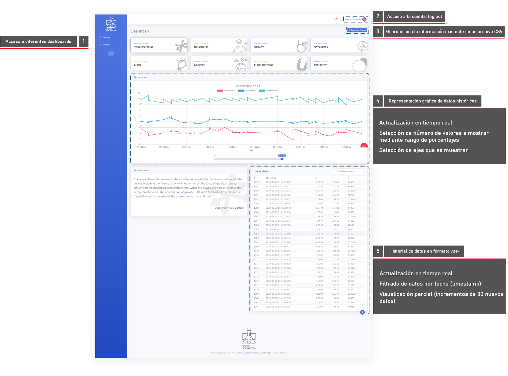
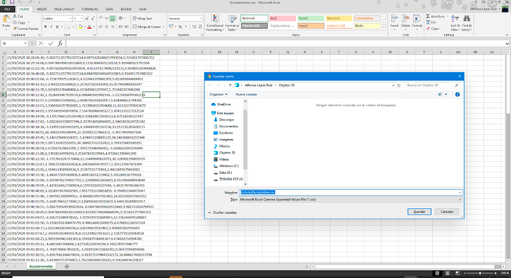
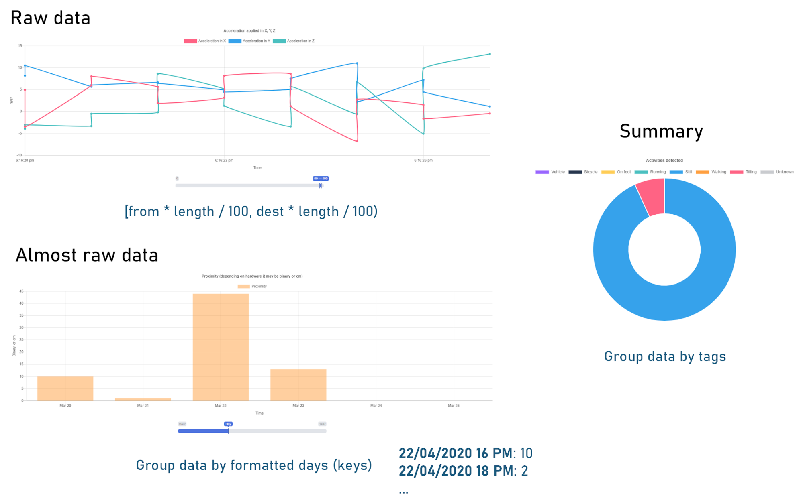
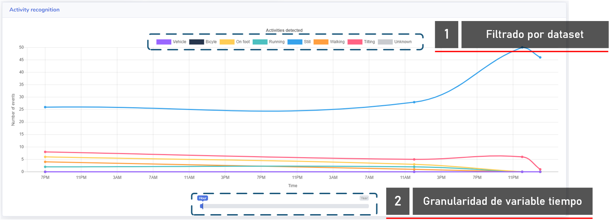

# Sensor Laboratory
Este repositorio alberga la versión web de la aplicación Sensor Laboratory, ideada como proyecto final del módulo 1 de la asignatura de Sistemas Empotrados y Ubicuos.

### Objetivo

El objetivo de esta aplicación web es permitir al usuario visualizar en tiempo real los datos que ha recuperado con su dispositivo móvil. No sólo se pretende dar acceso a los datos *raw* previamente obtenidos (p. ej. valor y marca de tiempo), sino también mostrar una evolución a lo largo del tiempo mediante aquellos recursos gráficos que se adapten mejor al sensor que se trata.

#### Acceso

La primera versión de Sensor Laboratory tan sólo permite el acceso mediante una cuenta de Google, de tal manera que la única opción disponible sin habernos identificado previamente es el *Sign in*.

Este prototipo no contiene aún configuración relacionada con la cuenta. Por tanto, una vez identificados, sólo tendremos las opciones de visualizar datos y cerrar sesión.

### Visualización de datos

Los sensores y plugins disponibles se corresponden exactamente con los que se muestran en la aplicación móvil; los sensores hacen alusión a datos *raw* obtenidos del dispositivo móvil, mientras que los *plugins* aplican cierto procesamiento (pudiendo ser más o menos complejo) sobre dichos datos *raw*.

Un ejemplo de página dedicada a la visualización de datos del acelerómetro es la siguiente:

- En primer lugar se muestran los gráficos que agrupan y muestran la evolución temporal de los datos.

- En segundo lugar se muestra una lista de datos *raw*, pudiéndose descargar estos mismos en formato CSV (*Generate report* en la esquina superior derecha).

El formato de un archivo **CSV** exportado se muestra a continuación:

#### Tipos de gráficos

Para completar esta sección se describe en la siguiente imagen qué tipo de gráficos podemos hallar en esta aplicación web:

De todos ellos, se destaca los gráficos que permiten realizar un seguimiento de los datos a lo largo del tiempo, los cuales se muestran (y gestionan) como se muestra en la siguiente imagen:

